# Nurture Nature 🌳🌲🌼🌻

## If you care about the quality of the environment and love volunteering, this app is especially for you.

### In recent years, awareness of the importance of preserving the environment in which we live and restoring damage that has already been done has grown, in order to enable a good quality of life, present and future, for the human species on planet Earth.!

### The main environmental problems in Israel are: the shortage of open spaces in cities, the problem of the sea and the coast - pollution of the sea and coast and loss of sand due to excavation and construction along the coast, pollution of streams, accumulation of solid waste and air pollution.

#### The goal of this app is to establish a social community of people who are interested in preserving the cleanliness of the environment! 🙋‍♀️🙋‍♂️

# Here's how the app works:

- ## Home Page :
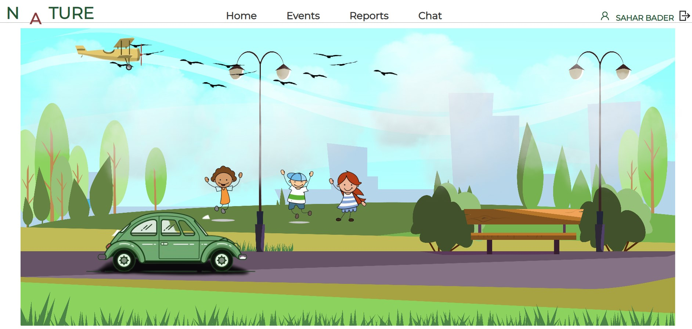 

- ## Register page:
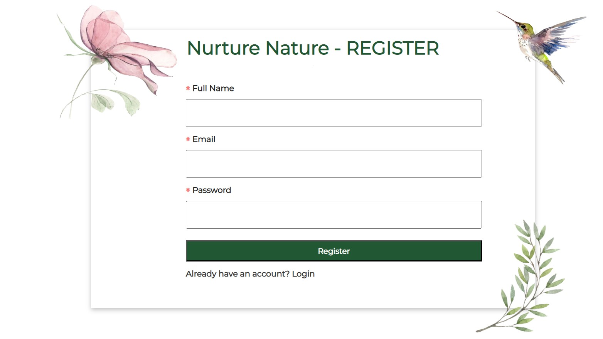 

- ## Login page:
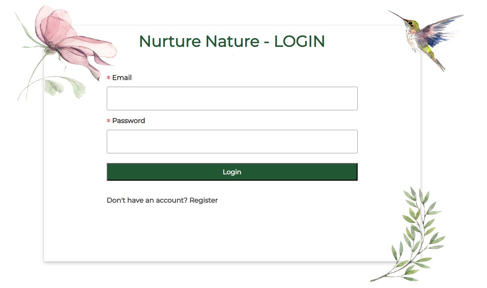 

- ## Events page:
#### Here you can search for events by region in Israel.
#### You can click on the desired region and a list of upcoming events will appear.
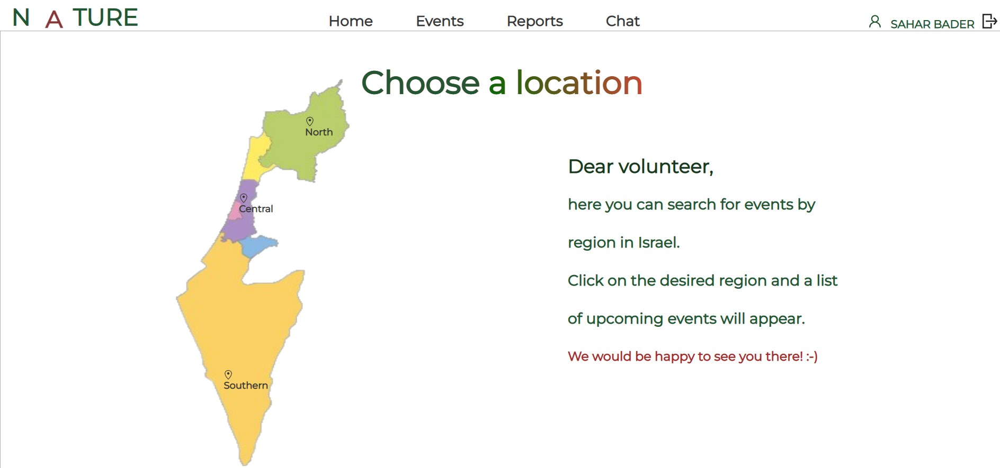 
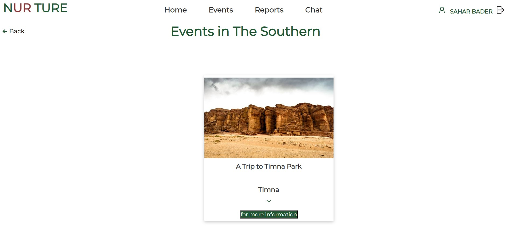 

#### Only an admin can add, edit or delete an event

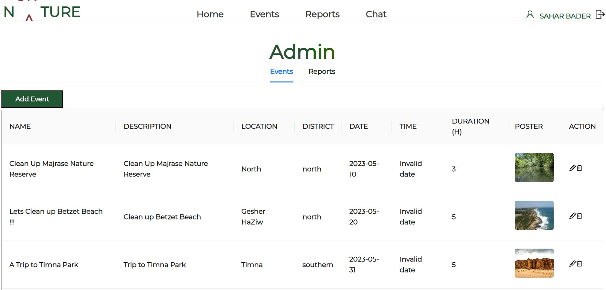 
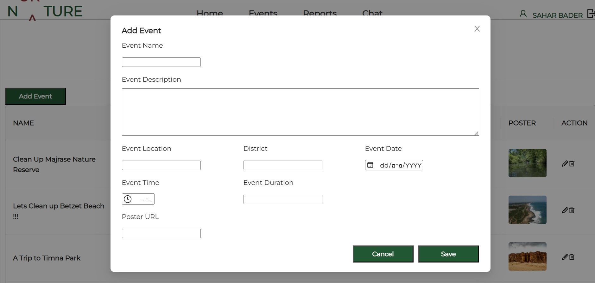 

- ## Reports page:
#### Come across a neglected area? Filled with litters?Report it to us!
#### We will organize a cleanup day and go clean it up! And it will be thanks to you.
#### The user can add a new report by clicking on the "Add new report" button.
#### In the Action column the user can edit or delete the report.
#### In the Status column he can follow up on the handling of the report.

` Of course, each user sees only their own reports!`

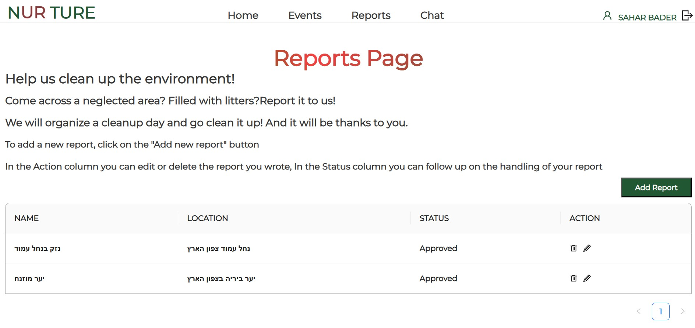 
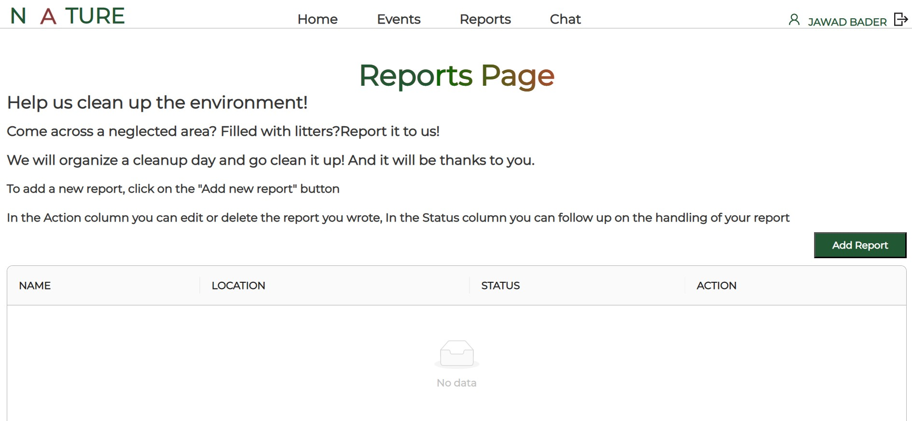  

#### The admin receives reports from all users and can approve or reject them.
#### (And it will also appear to the user)

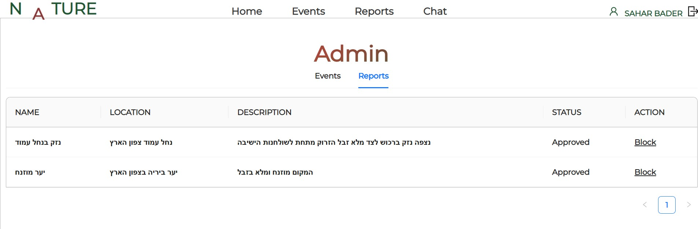  

- ## Chat page
#### You may wonder why there's a chat feature. I strongly believe that in order to encourage people to participate in the volunteer activities we organize, we need to create a social connection as well. People should be able to talk to each other, and through social connections, they will want to come, volunteer, meet and get to know each other.
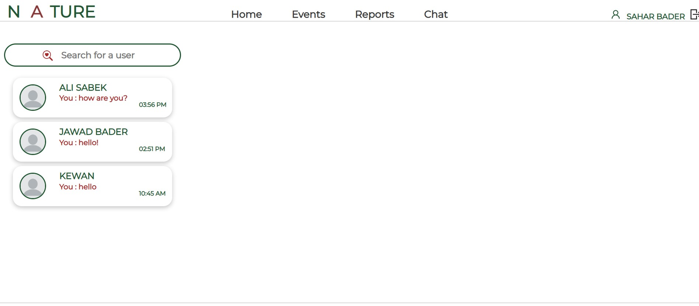  
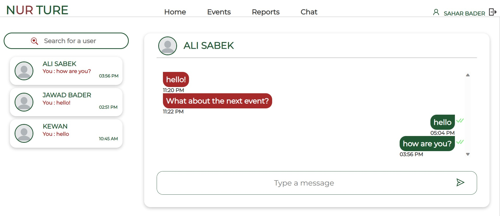  

- ## I have to admit that I'm very excited about the logo and the loading page!🙂
 #### The letters are switching. 🤭
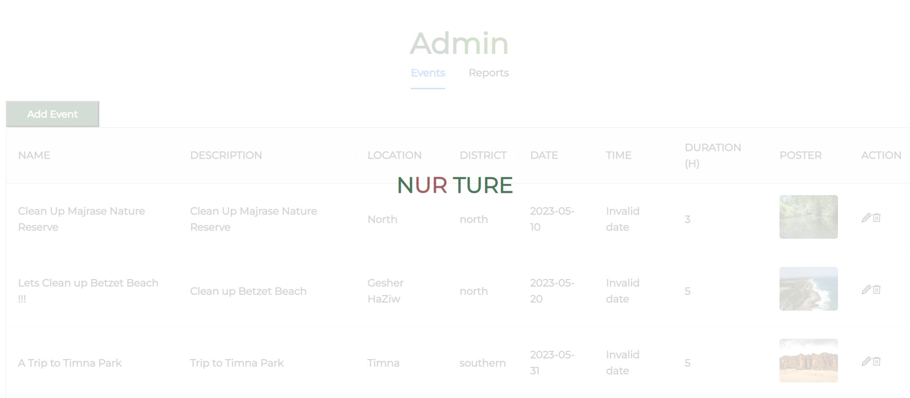  
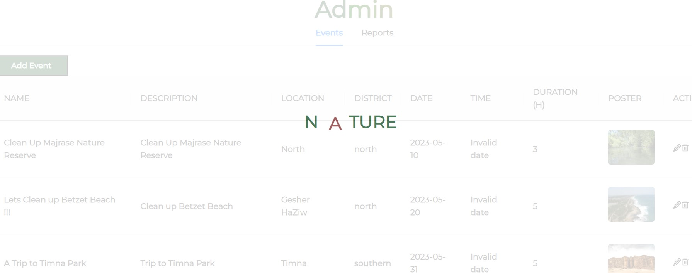  

- ## Of course, Its responsive! 🙂
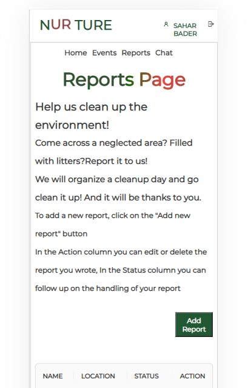  
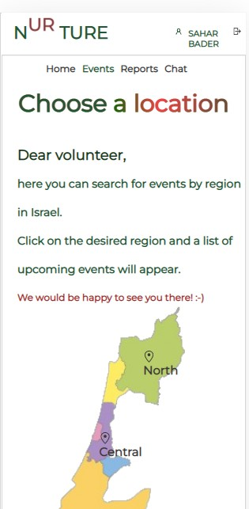  
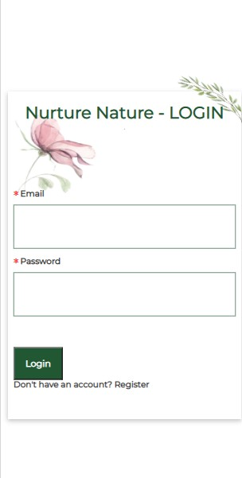  

- ## Demo site line: 
## https://nurture-the-nature.onrender.com/